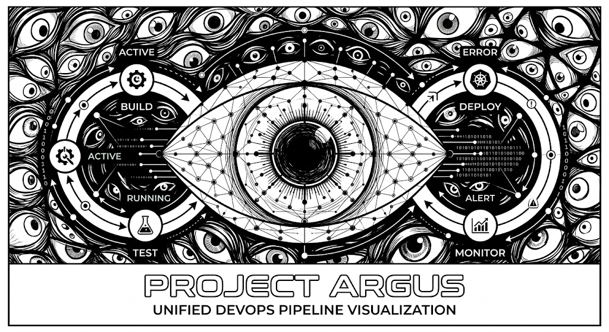

<p align="center">
  
</p>

<p align="center">
  <em>Built for the lablab.ai "Back for Another Hack: Meet IBM Bob 2.0" Hackathon</em>
</p>

# Project Argus

A live DevOps health graph that brings alerts, logs, traces, and events from different tools into one unified topology view. Instead of checking GitHub Actions, Docker, Kubernetes, and Prometheus separately, Argus correlates cascading failures and visualizes how an incident moves through your pipeline.

## 🚀 Quick Start (Demo Mode)

We have built a single-command demo that automatically provisions a mock project, detects its DevOps tools, and spawns the live topology map.

1. Ensure you have Node.js and Python 3 installed.
2. From the root of the repository, build the frontend once:
   ```bash
   cd frontend
   npm install
   npm run build
   cd ..
   ```
3. Set up the Python environment and install the Argus CLI:
   ```bash
   python3 -m venv backend/venv
   source backend/venv/bin/activate
   pip install -r backend/requirements.txt
   pip install -e argus-cli
   ```
4. Run the demo script! This will spawn the backend, push simulated incident events, and provide you with a link to the UI.
   ```bash
   ./demo-project/run_demo.sh
   ```
5. Click the link provided in the terminal (usually `http://localhost:8090`) to view the glowing topology map!

## 🚧 Current Status & Future Improvements

This project was built rapidly during the hackathon. While the core vision is functional, there are several areas we are currently working on improving:

### Frontend Needs Improvement
- **Responsive Design & Scaling:** The Cytoscape canvas and glassmorphic sidebar are currently optimized for desktop views. Mobile responsiveness and smoother zooming/panning controls need refinement.
- **Deeper Interactivity:** Clicking nodes currently opens a static incident sidebar. We plan to add deeper drill-downs (e.g., viewing raw logs, restarting pods directly from the UI).

### Backend Needs to be Fully Dynamic
- **Dynamic Topology Inference:** Currently, the Argus CLI detects tools and creates the pipeline stages dynamically, but the backend correlation engine still relies heavily on predefined rules for the "demo" topology. We are working on making the backend automatically infer dependencies and rules strictly from live data without hardcoded fallbacks.
- **Real-time Connectors:** The `argus-cli` correctly detects real configuration files in repositories, but the active incident stream currently relies on simulated mock data to demonstrate failure correlation. Future updates will connect fully to live Kubernetes and Prometheus APIs.

## 🎯 How It Works

`argus-cli` scans project files (`.github/workflows/`, `Dockerfile`, `k8s/`, `prometheus.yml`) to infer active tools and stage order. It sends raw events to the FastAPI backend, which normalizes them into standard Event objects.

The correlation engine then looks for related events and groups them into incidents.

For example:
```text
Deploy failed
     ↓
Backend Pod failed
     ↓
Database connection error
     ↓
HTTP 500 rate increased
```
Instead of showing these as four separate alerts across four different dashboards, Argus displays them as **one incident** with a human-readable evidence chain.

## 🛠️ Tech Stack

**Backend & CLI Tool:**
* Python, FastAPI, Uvicorn
* Pydantic
* Custom `argus-cli` tool (Argparse, HTTPX)

**Frontend:**
* TypeScript
* Vite
* Cytoscape.js (for high-performance graph rendering)

---
Built for the **lablab.ai "Back for Another Hack: Meet IBM Bob 2.0" Hackathon**.
